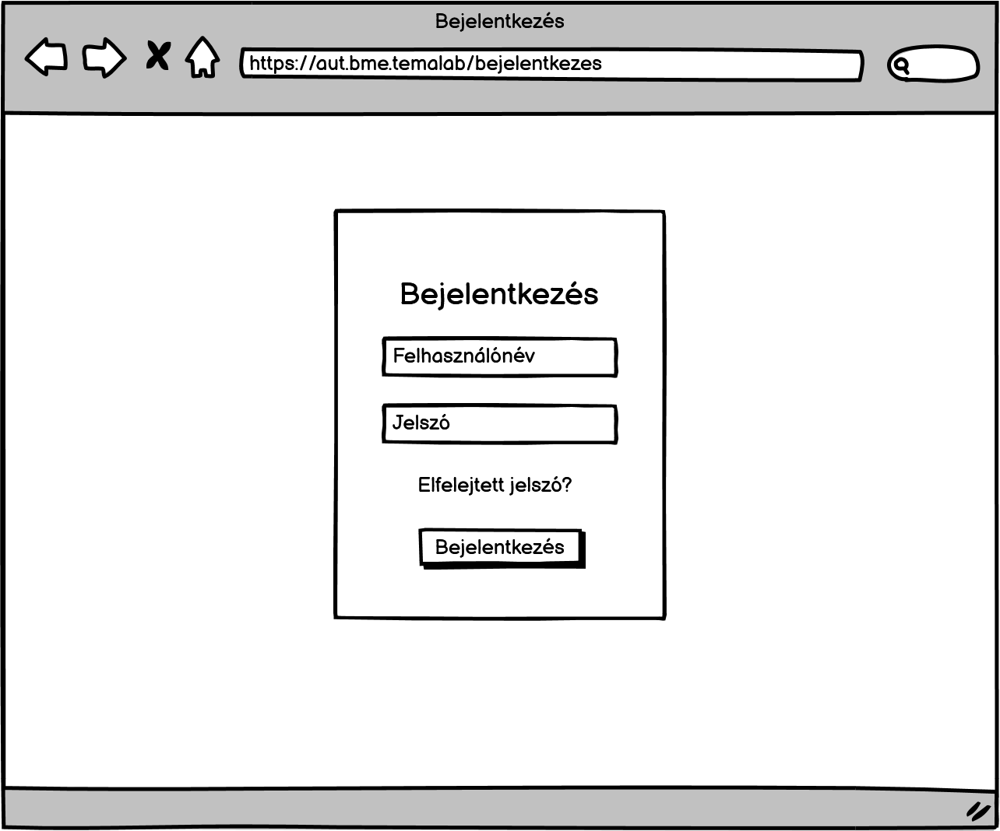
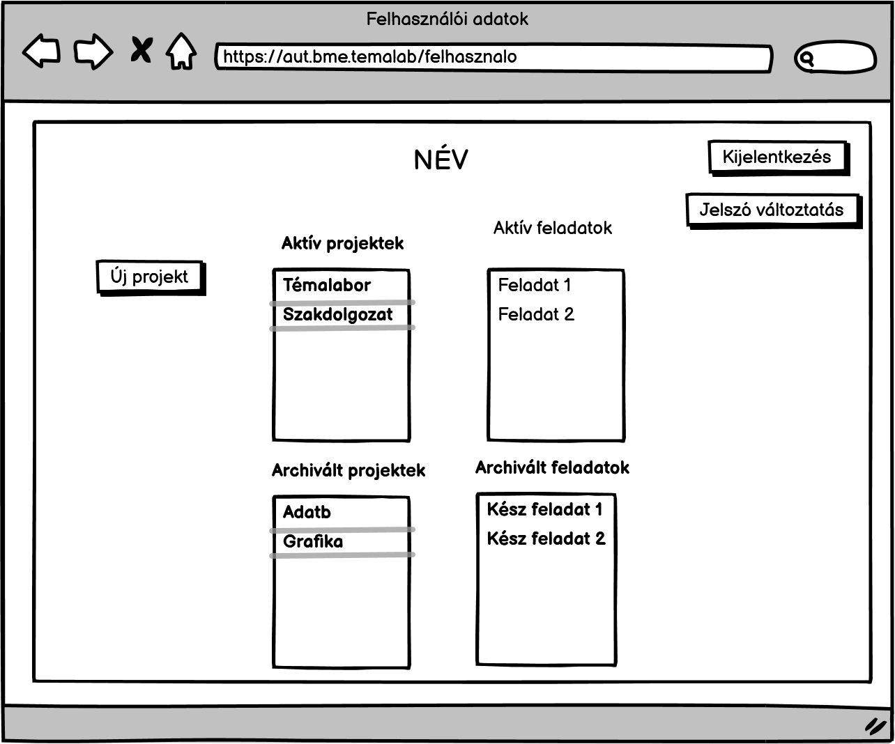
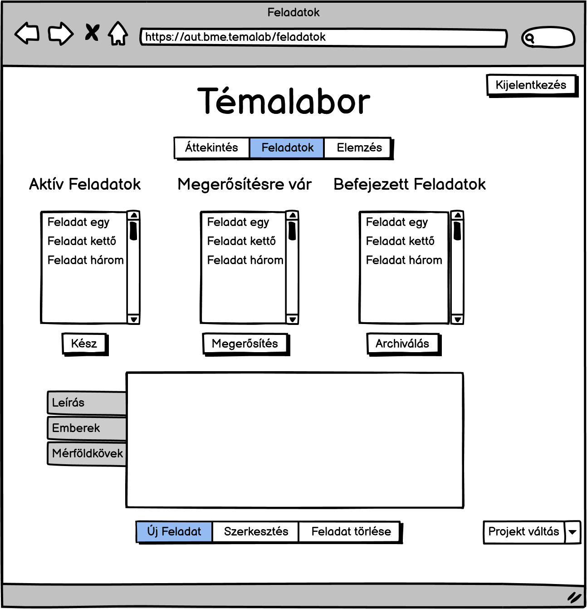
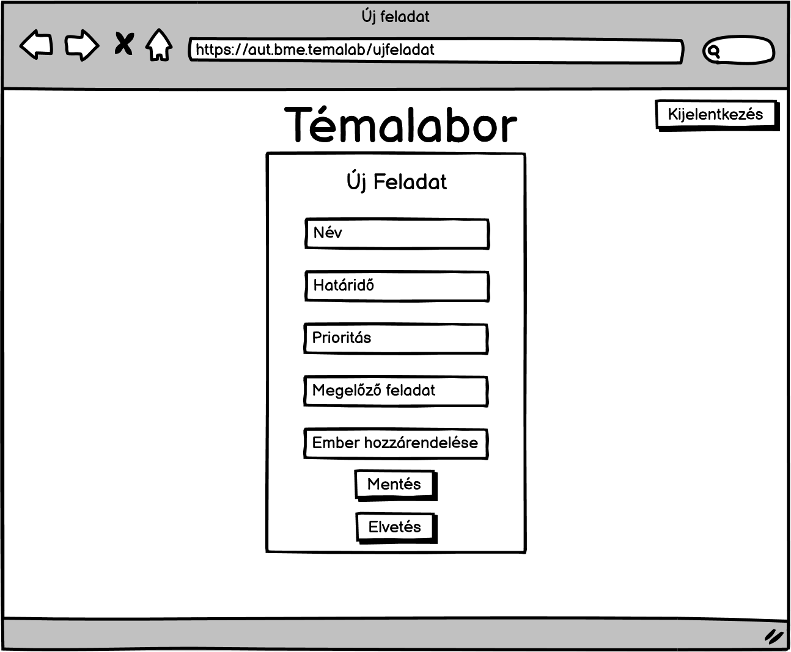
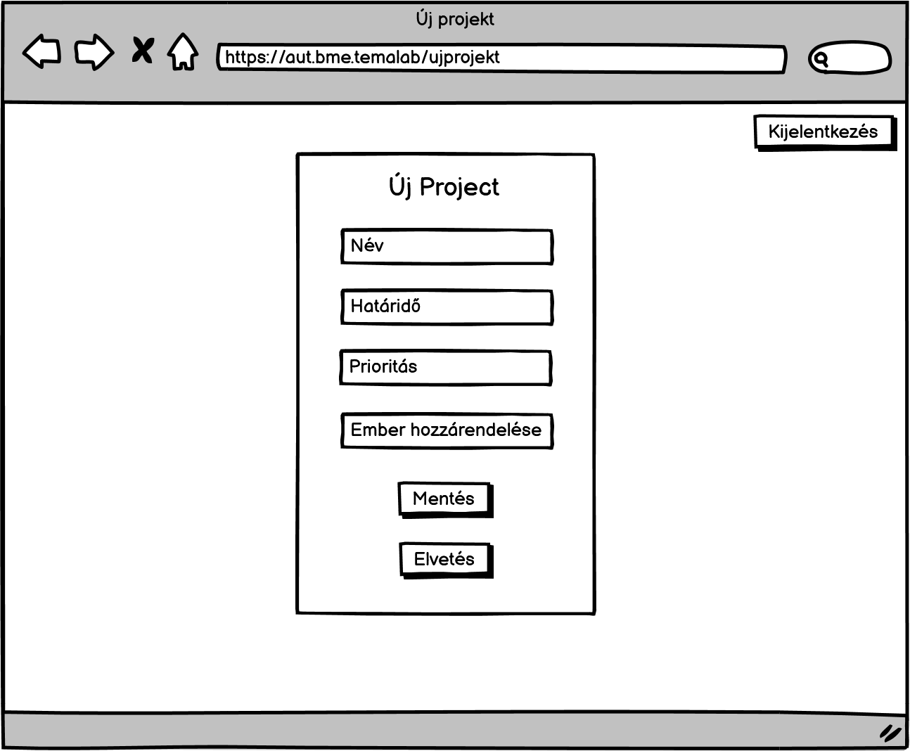
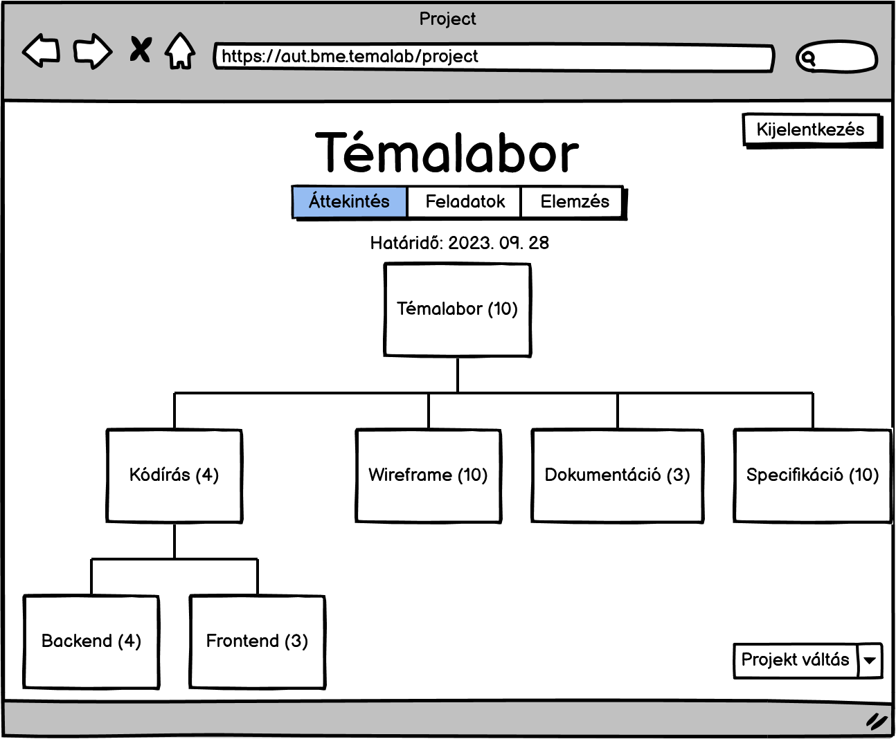
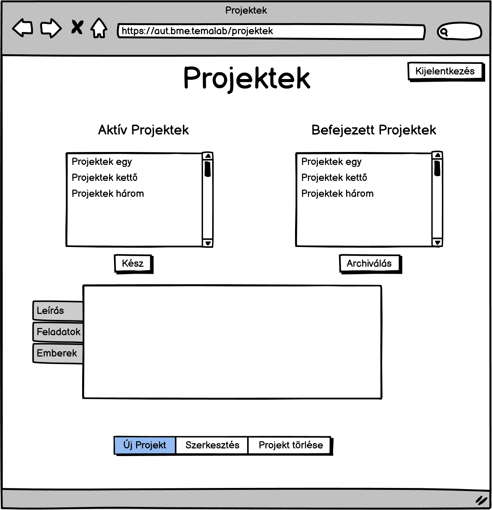
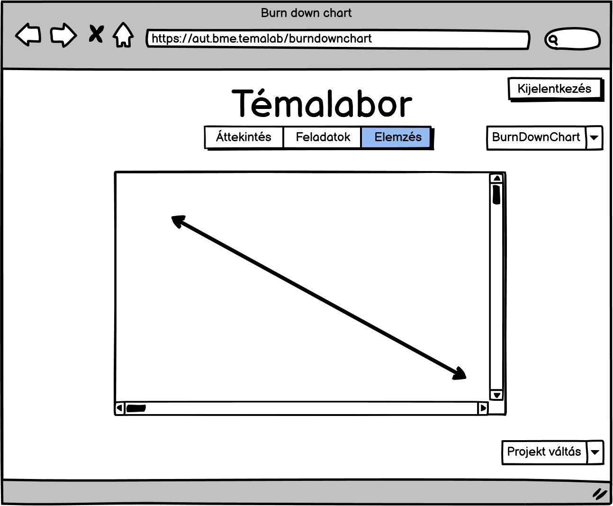
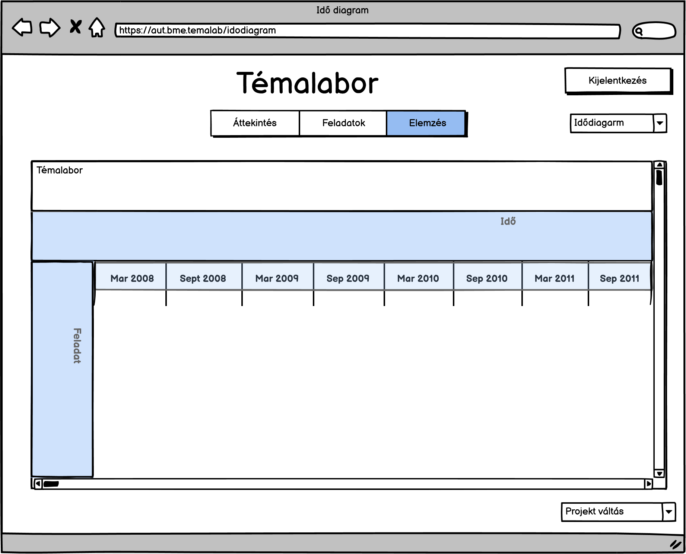

# Szoftverfejlesztés .NET platformon

## Használni kívánt technikák:
* ### .NET 7
    * ### Blazor (ASP.NET 7)
        * ### SPA rendering
            * Csapatunk úgy döntött, hogy projektek menedzselésére alkalmas applikációt tervez. A kivitelezést **Blazor (ASP.NET 8)** keretrendszerrel szeretnénk megvalósítani SPA renderinget használva.
            * **REST API**

    * ### EF Core 7
        * Az applikáció az adatokat egy relációs adatbázisból veszi, az újonnan felvett adatokat szintén ebben az adatbázisban rögzíti. Az adatok kezelésére EF Core 7 keretrendszert tervezünk használni. 

## Bejelentkező oldal
Az alkalmazás egy bejelentkező felület után képes lesz megjeleníteni a felhasználó adatait.

* Projektek, amikben jelenleg részt vesz, a múltbéli projekteket.
Ha a felhasználó rendelkezik megfelelő jogosultsággal, képes új projektet létrehozni a rendszerben, ha nem, akkor azokhoz a projektekhez van hozzáférése, amelyekben szerepel, illetve amelyekhez külön engedélyt kapott. 

## Feladat menedzsment:
* Projekt neve
* Projekt célja + Rövid, ismertető leírás
* Részletes leírás + Kiegészítő dokumentumok
* Mérföldkövek
* Munkatársak
    * Projektvezető (+ cégen belüli szervezet)
        * Projektvezető jogosultságai
    * Projekten dolgozó kollégák + felelősségkörök

* ### **A feladatok listája lehet kanban board stílusú, ekkor drag and dropolni lehet a feladatokat az állapotok között (ez például szerver oldali renderinggel hatalmas szívás)**
* ### **A projekt váltás gomb kerüljön a fejlécbe, a kontextusváltás jellemzően oda kerül**

* Új feladatok létrehozása

* Új projektek létrehozása

* •	Projekthez tartozó feladatok + részfeladatok
    * Feladatok közötti függőség (hierarchia)
    * Feladatok határideje
    * Feladatok prioritása
    * Elvégzendő/Elvégzett feladatok grafikus megjelenítése
        * ### **A projekt fája lehet egy tree view, lenyitható szövegcímkékkel (ez általánosabb és kevésbé szívás)**

* Feladatok fontosságának megjelnítése és időbeosztása.

## Elemzés és jelentés:
* ### Projekt tervezés és beosztás:
    * BurnDown diagarm.
    

    ### Időbeosztás megtervezése és beosztása:
    * Feladat határidők kiosztása.
    * Feladatok időbeli követése.
    